# NeoTradingBot 1777 - Architecture Diagrams

This document contains comprehensive architecture diagrams for the NeoTradingBot 1777 system, providing visual representations of the system's structure, data flows, and component interactions.

## Table of Contents

1. [System Overview](#system-overview)
2. [Clean Architecture Layers](#clean-architecture-layers)
3. [Trading Flow Diagram](#trading-flow-diagram)
4. [Data Flow Diagram](#data-flow-diagram)
5. [Component Interaction Diagram](#component-interaction-diagram)
6. [Security Architecture](#security-architecture)
7. [Deployment Architecture](#deployment-architecture)

## System Overview

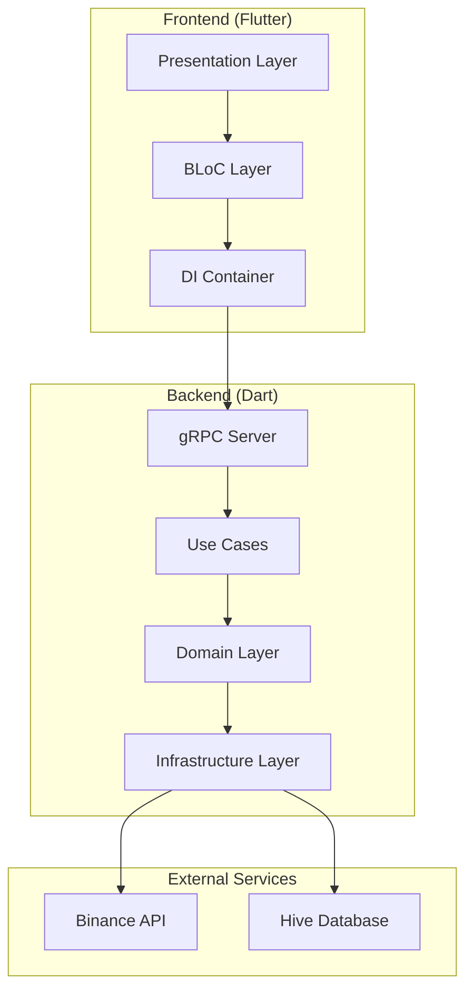

## Clean Architecture Layers

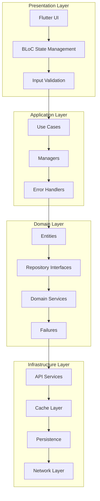

## Trading Flow Diagram

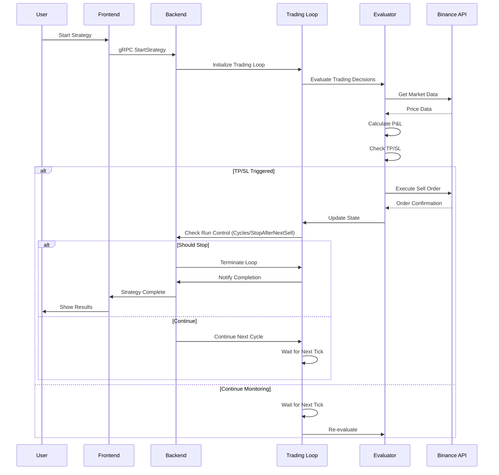

## Data Flow Diagram

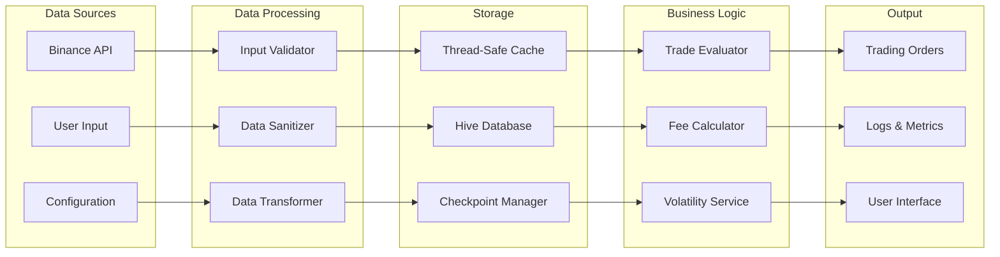

## Component Interaction Diagram

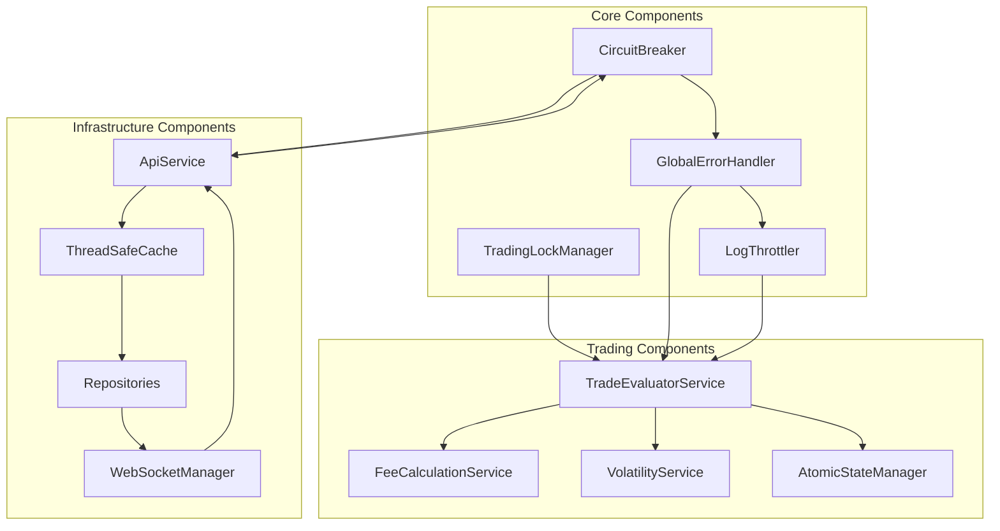

## Security Architecture

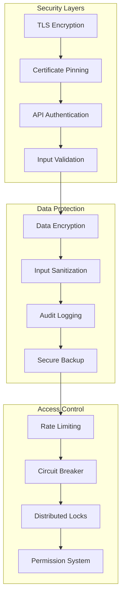

## Deployment Architecture

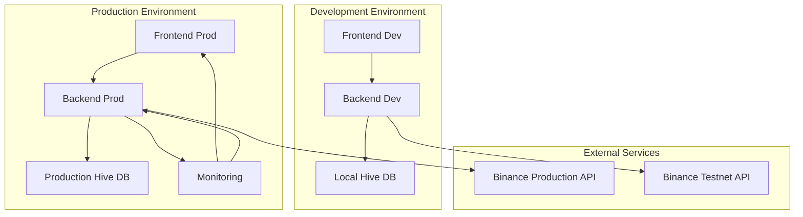

## Trading Strategy Flow

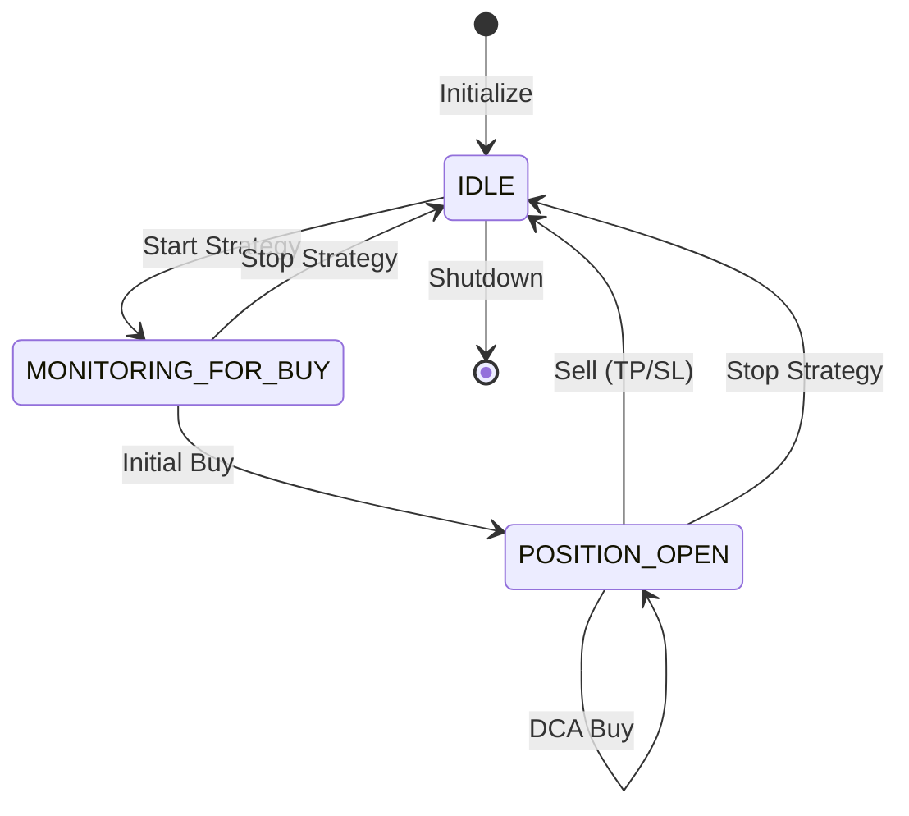

## Error Handling Flow

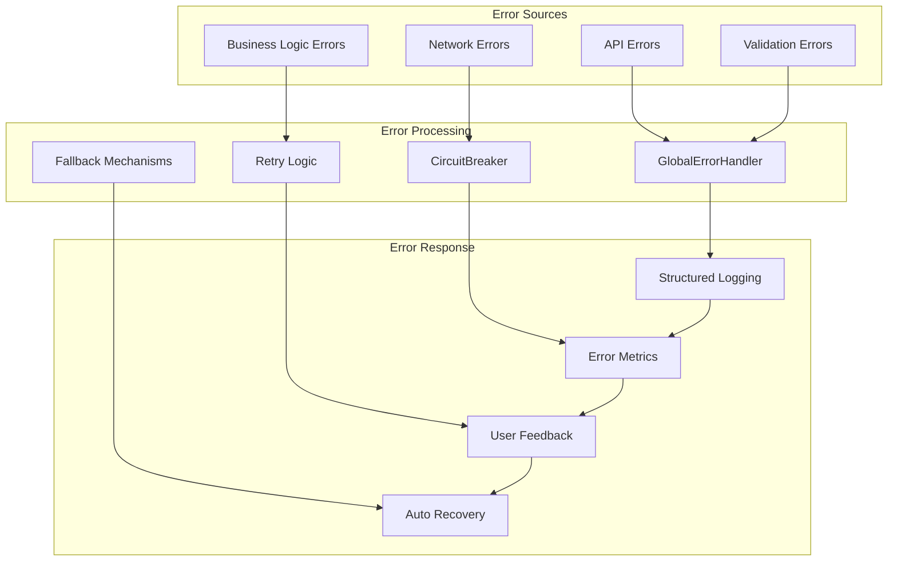

## Performance Monitoring Architecture

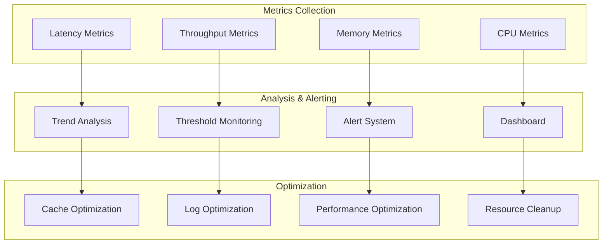

## Database Schema

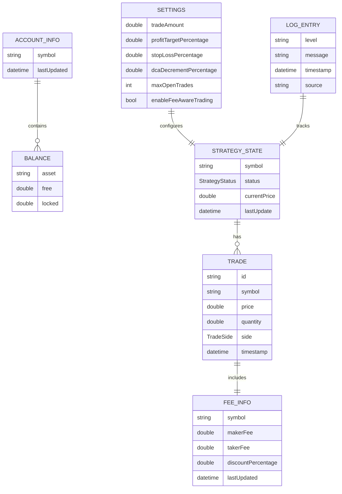

## API Endpoints Structure

```mermaid
graph TB
    subgraph "gRPC Services"
        TRADING_SERVICE[TradingService]
        HEALTH_SERVICE[HealthService]
    end

    subgraph "TradingService Methods"
        GET_SETTINGS[GetSettings]
        UPDATE_SETTINGS[UpdateSettings]
        START_STRATEGY[StartStrategy]
        STOP_STRATEGY[StopStrategy]
        PAUSE_TRADING[PauseTrading]
        RESUME_TRADING[ResumeTrading]
        GET_STRATEGY_STATE[GetStrategyState]
        GET_TRADE_HISTORY[GetTradeHistory]
        GET_ACCOUNT_INFO[GetAccountInfo]
        STREAM_CURRENT_PRICE[StreamCurrentPrice]
        GET_SYMBOL_FEES[GetSymbolFees]
    end

    subgraph "HealthService Methods"
        CHECK[Check]
        WATCH[Watch]
    end

    TRADING_SERVICE --> GET_SETTINGS
    TRADING_SERVICE --> UPDATE_SETTINGS
    TRADING_SERVICE --> START_STRATEGY
    TRADING_SERVICE --> STOP_STRATEGY
    TRADING_SERVICE --> PAUSE_TRADING
    TRADING_SERVICE --> RESUME_TRADING
    TRADING_SERVICE --> GET_STRATEGY_STATE
    TRADING_SERVICE --> GET_TRADE_HISTORY
    TRADING_SERVICE --> GET_ACCOUNT_INFO
    TRADING_SERVICE --> STREAM_CURRENT_PRICE
    TRADING_SERVICE --> GET_SYMBOL_FEES

    HEALTH_SERVICE --> CHECK
    HEALTH_SERVICE --> WATCH
```

---

## Legend

- **Solid arrows**: Direct dependencies
- **Dashed arrows**: Optional or conditional dependencies
- **Rectangles**: Components/Modules
- **Circles**: External services
- **Diamonds**: Decision points
- **Hexagons**: Data stores

## Notes

- All diagrams are created using Mermaid syntax
- Diagrams can be rendered in any Mermaid-compatible viewer
- Architecture follows Clean Architecture principles
- Security is implemented at multiple layers
- Performance monitoring is built-in throughout the system
- Error handling is centralized and comprehensive

