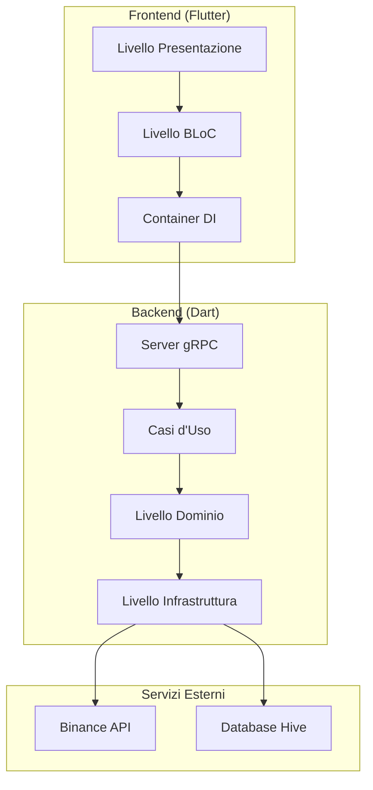
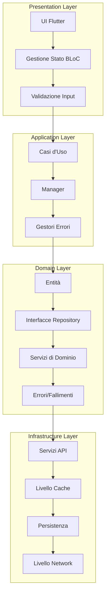
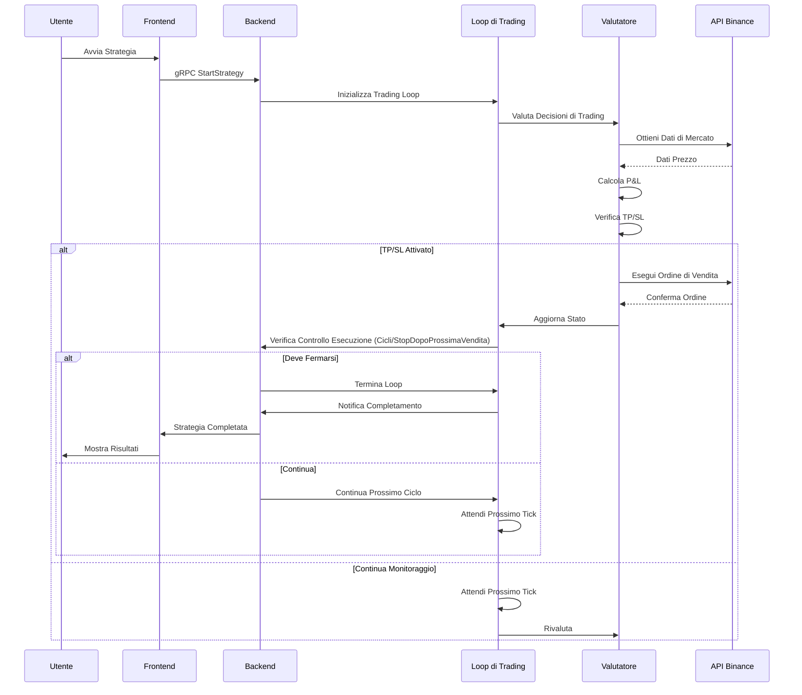
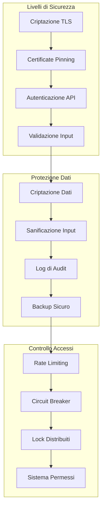
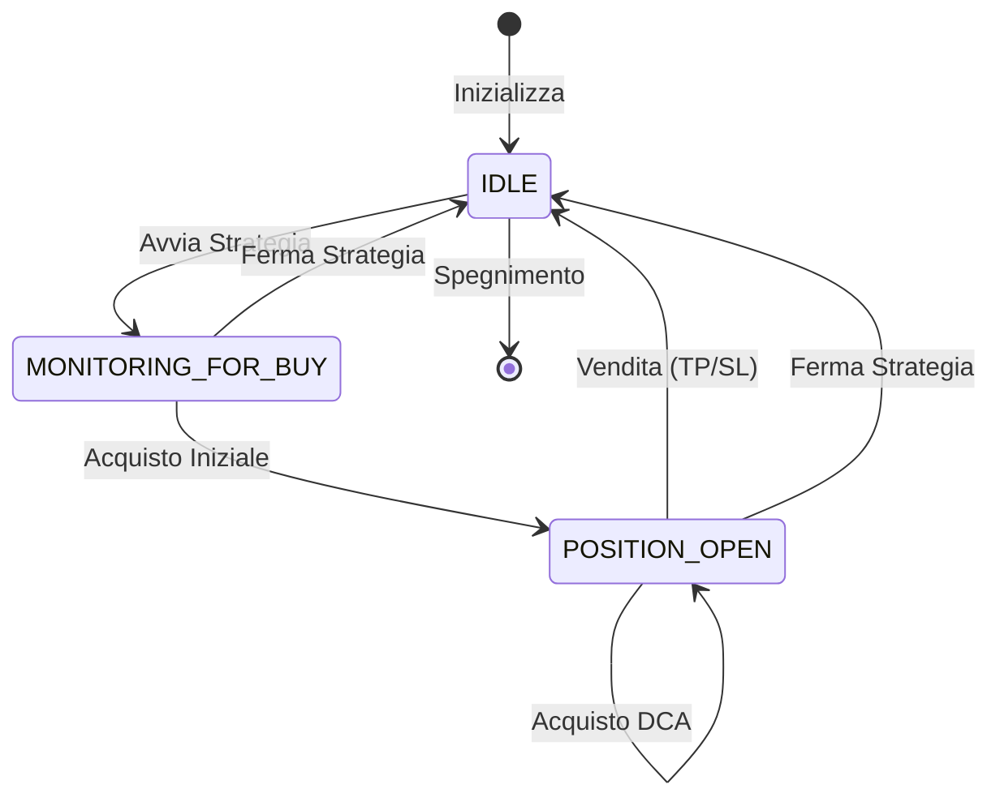

# NeoTradingBot 1777 - Diagrammi dell'Architettura

Questo documento contiene i diagrammi completi dell'architettura per il sistema NeoTradingBot 1777, fornendo rappresentazioni visive della struttura del sistema, dei flussi di dati e delle interazioni tra i componenti.

## Sommario

1. [Panoramica del Sistema](#panoramica-del-sistema)
2. [Livelli Clean Architecture](#livelli-clean-architecture)
3. [Diagramma del Flusso di Trading](#diagramma-del-flusso-di-trading)
4. [Diagramma del Flusso di Dati](#diagramma-del-flusso-di-dati)
5. [Diagramma di Interazione tra Componenti](#diagramma-di-interazione-tra-componenti)
6. [Architettura della Sicurezza](#architettura-della-sicurezza)
7. [Architettura di Deploy](#architettura-di-deploy)

## Panoramica del Sistema

## Livelli Clean Architecture

## Diagramma del Flusso di Trading

## Architettura della Sicurezza

## Stato della Strategia di Trading

---

## Legenda

- **Frecce continue**: Dipendenze dirette
- **Frecce tratteggiate**: Dipendenze opzionali o condizionali
- **Rettangoli**: Componenti/Moduli
- **Cerchi**: Servizi esterni
- **Rombi**: Punti di decisione
- **Esagoni**: Archivi dati

## Note

- Tutti i diagrammi sono creati usando la sintassi Mermaid
- L'architettura segue i principi della Clean Architecture
- La sicurezza è implementata a più livelli
- Il monitoraggio delle prestazioni è integrato in tutto il sistema

