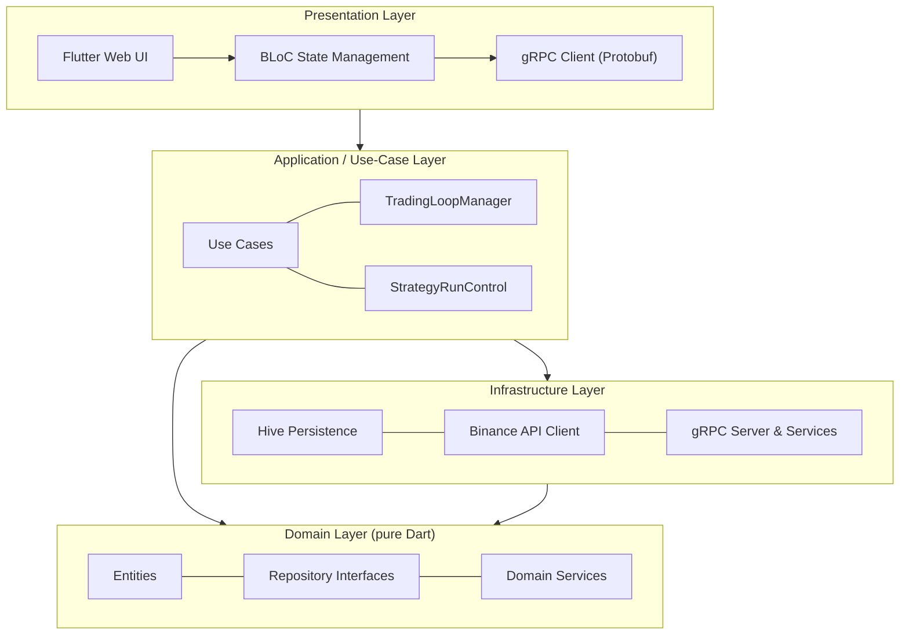
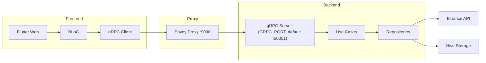
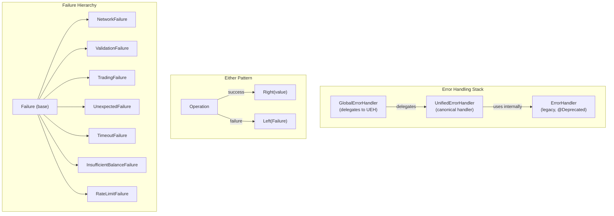
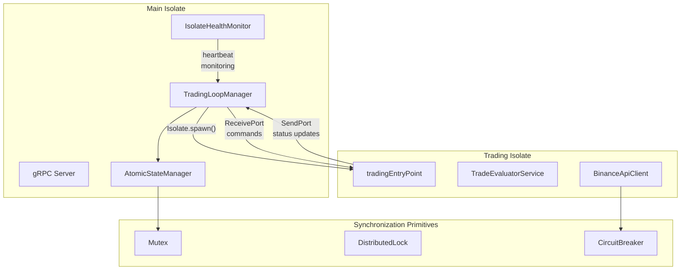

# Technical Architecture: NeoTradingBot1777

## Status: IMPLEMENTED

The system follows **Clean Architecture** principles to ensure maintainability, testability, and scalability.

---

## Architecture Layers



- **Domain Layer**: Contains entities (`FifoAppTrade`, `AppSettings`, `Balance`), repository interfaces, and domain services (`TradeEvaluatorService`, `QuantityCalculatorService`). Pure Dart, zero dependencies on external frameworks.
- **Application Layer**: Orchestrates business logic via Use Cases and Managers (e.g., `TradingLoopManager`, `ManageStrategyRunControlUseCase`).
- **Infrastructure Layer**: Implementation of repositories (`Hive` adapters), network clients (Binance REST/WebSocket API), gRPC services, and persistence.
- **Presentation Layer**:
    - **Backend**: gRPC services exposing the domain logic via Protobuf contracts.
    - **Frontend**: Flutter BLoC for state management, Go Router for navigation, and themed widgets.

---

## Communication Flow



---

## Data Flow

### Trading Loop Lifecycle

```mermaid
sequenceDiagram
    participant UI as Flutter UI
    participant Bloc as SettingsBloc / StrategyStateBloc
    participant gRPC as gRPC Client
    participant Server as TradingServiceImpl
    participant Loop as TradingLoopManager
    participant Isolate as Trading Isolate
    participant Binance as Binance API

    UI->>Bloc: Dispatch StartStrategy
    Bloc->>gRPC: StartStrategy RPC
    gRPC->>Server: StartStrategy(settings)
    Server->>Loop: startLoop(settings)
    Loop->>Isolate: Isolate.spawn(tradingEntryPoint)
    
    loop Every Tick
        Isolate->>Binance: GET /api/v3/ticker/price
        Binance-->>Isolate: PriceResponse
        Isolate->>Isolate: TradeEvaluatorService.evaluate()
        alt Should buy/sell
            Isolate->>Binance: POST /api/v3/order
            Binance-->>Isolate: OrderResponse
        end
        Isolate-->>Loop: SendPort → status update
    end
    
    Loop-->>Server: Stream<StrategyState>
    Server-->>gRPC: gRPC Stream
    gRPC-->>Bloc: Update state
    Bloc-->>UI: Rebuild widgets
```

### Settings Read/Write Flow

1. **Frontend** → `SettingsBloc` dispatches `SettingsFetched` / `SettingsSubmitted`
2. **SettingsBloc** → gRPC `GetSettings` / `UpdateSettings`
3. **Server** → `SettingsServiceImpl` → `SettingsRepositoryImpl` (Hive)
4. **Server** → Validates & clamps values → emits `SETTINGS_CLAMP` log if clamped
5. **Response** → BLoC updates state, UI rebuilds

---

## Error Handling Architecture



- **Pattern**: All domain operations return `Either<Failure, T>` (via `dartz` package).
- **`UnifiedErrorHandler`** is the canonical handler: async/sync operations, network retry, validation, business logic, persistence, and trading-specific operations.
- **`ErrorHandler`** (deprecated) and **`GlobalErrorHandler`** delegate to `UnifiedErrorHandler`.
- **Frontend**: `ErrorBoundary` widget catches uncaught Flutter errors; `AppSnackBar` helper provides consistent error/warning/success notifications.

---

## Concurrency & Isolate Architecture



### Key Mechanisms

- **Isolate-based Execution**: Trading loops run in dedicated Dart isolates to prevent UI/server blocking.
- **`IsolateHealthMonitor`**: Heartbeat-based liveness detection with automatic restart.
- **`AtomicStateManager`**: Thread-safe state management with `Mutex` for atomic updates.
- **`CircuitBreaker`**: Protects external API calls (Binance) from cascading failures.
- **`DistributedLock`**: Event-loop-friendly locking (no spin-wait).
- **gRPC Streaming**: Real-time bi-directional data flow for prices and status updates.
- **Envoy Proxy**: Enables gRPC-Web for Flutter Web compatibility.
- **API Key Auth**: Server-side `x-api-key` header validation (optional, enable via `GRPC_API_KEY` env).

---

## Configuration (Environment Variables)

| Variable | Default | Description |
|---|---|---|
| `GRPC_PORT` | `50051` | Backend gRPC server port |
| `GRPC_HOST` | `localhost` | Frontend: backend host address |
| `GRPC_API_KEY` | _(disabled)_ | Shared secret for API auth |
| `GRPC_ALLOW_INSECURE` | `false` | Allow non-TLS connections |
| `CERT_PATH` / `KEY_PATH` | — | TLS certificate paths |
| `STRICT_BOOT` | `false` | Prevents startup without TLS or on fatal errors |
| `BINANCE_API_KEY` | — | Binance API key (stored securely) |
| `BINANCE_SECRET_KEY` | — | Binance secret key (stored securely) |

---
Generated by Ralph Doc Automation. Updated Feb 2026.